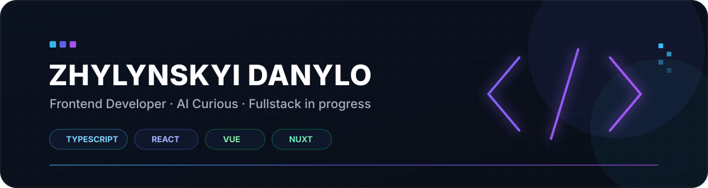

 

I build responsive web applications, interactive interfaces and developer tools with **TypeScript, React, Vue and Nuxt**.

 

---

## About me

Frontend developer focused on building modern web interfaces and products.

- Working primarily with **TypeScript, React, Vue and Nuxt**
- Interested in frontend architecture, UI/UX, performance and **Artificial Intelligence**
- Building web applications, interactive interfaces and tools
- Expanding into backend development with **Node.js, APIs and databases**
- Working toward becoming a **Fullstack Developer**
- Building things with code since **2020**

  

## Currently

- Exploring **AI / Machine Learning**
- Expanding into **backend development**
- Working toward **Fullstack Development**
- Improving my knowledge of **software architecture**

## Tech stack

  

### Frontend & Beyond

### Pixels & Motion

### Backend & Tools

---

## Projects

### Blitzkrieg Tracker

A training and statistics tool for **Geometry Dash**, built as a native Geode mod.

Features include:

- Training stages and run tracking
- Player statistics
- Profiles
- Backups and data export
- API integration
- Admin tools and news system

**Tech:** C++, Geode, Node.js, Express, PostgreSQL

---

### Melonity

Frontend development for the main website and related products.

**Tech:** Vue, Nuxt, TypeScript

---

### ModsNation

Interactive web project featuring a **3D garage/interface**.

**Tech:** React, TypeScript, Three.js

---

## Experience with frameworks

| Technology | Since |
| ---------- | ----- |
| React      | 2021  |
| Next.js    | 2021  |
| Vue        | 2023  |
| Nuxt       | 2023  |

---

### Contact

Open to interesting projects, collaborations and frontend opportunities.

  

